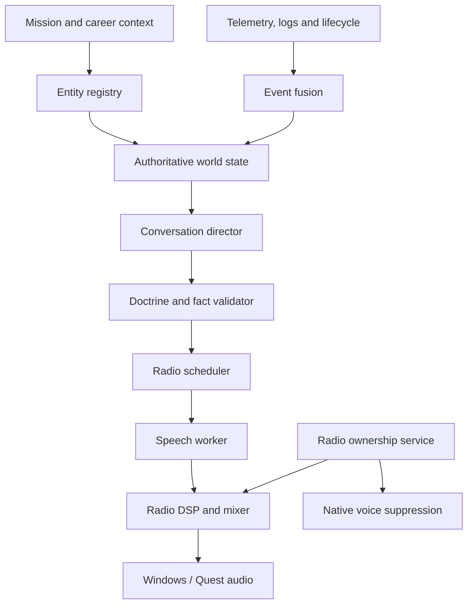
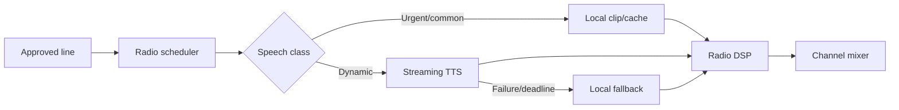

# IL-2 Career Wingman — Authoritative Project Blueprint

Date: 2026-09-18  
Status: Current project-level architecture and delivery plan

## 1. Product objective

Career Wingman is an external Windows companion for IL-2 Great Battles single-player Career. It adds a persistent, historically disciplined squadron-radio layer that reacts to the current sortie and remembers confirmed past sorties.

The intended participants include:

- the player and a flight of up to eight aircraft;
- ground control;
- escorting or escorted formations;
- other mission formations when they are identified reliably.

Career Wingman complements a Career Tracker. The tracker remains the authority for factual career history; Career Wingman turns verified mission context into in-flight character, tactical radio traffic and post-flight narrative continuity.

It does not replace IL-2 AI, issue controls to aircraft, modify the active mission, or fabricate unavailable game state.

## 2. Product boundary

### In scope

- read-only preflight mission parsing;
- read-only career-context import;
- live telemetry and log observation where proven;
- normalized mission events with provenance and confidence;
- deterministic tactical radio logic;
- constrained AI-authored non-critical dialogue;
- persistent fictional pilot voice/personality profiles;
- native IL-2 AI voice suppression during enhanced-radio ownership;
- external audio playback through the user's Windows/Quest route;
- optional external subtitles/VR display;
- post-flight reconciliation and replayable diagnostics.

### Out of scope for the core product

- DLL injection or process-memory access;
- writing directly to Career Tracker or IL-2 career databases;
- controlling IL-2 AI aircraft;
- relying on runtime modification of a loaded Career mission;
- relying on DServer chat/RCon for single-player Career;
- inventing exact aircraft events that IL-2 does not expose.

## 3. The complete runtime loop

A radio line is allowed to reach the player only after:

1. its triggering state or event is normalized;
2. its confidence is sufficient for the proposed claim;
3. the selected speaker and recipient exist;
4. the speaker has authority and radio availability;
5. the wording passes doctrine and historical checks;
6. the channel scheduler accepts its priority and expiry;
7. enhanced-radio ownership and native suppression are confirmed.

## 4. Runtime components

### 4.1 Launcher and supervisor

Starts the components, maintains one mission session ID, checks health, and performs crash recovery. It must be simple for the user: one executable/launcher and one settings interface.

### 4.2 Career Wingman Core

Owns:

- mission-context parsing;
- entity/formation registry;
- event fusion and confidence;
- authoritative world state;
- doctrine engine;
- conversation director;
- dialogue validation;
- persistent squadron memory;
- transcript and replay log.

This is the product's brain.

### 4.3 Radio Control Service

Evolves the reusable parts of Allied Radio without binding Career Wingman to release candidate 6.2.

Owns:

- native IL-2 voice suppression/restoration;
- renewable exclusive-radio lease;
- Combat / All / Broadcast policy;
- global hotkeys;
- lifecycle interlocks;
- broadcast mutual exclusion;
- audio-device policy;
- stale-session recovery.

Career Wingman may not transmit enhanced combat dialogue unless this service confirms ownership.

### 4.4 Speech Worker

Owns speech rendering only:

- local tactical clips;
- online streaming TTS adapters;
- local fallback TTS;
- voice mapping;
- PCM decoding and jitter buffering;
- synthesis cache;
- provider health, quota and cost tracking.

It does not interpret raw game data and does not decide what characters say.

### 4.5 Audio engine

Owns:

- one radio channel queue;
- priority and interruption;
- transmission start/end cues;
- WWII radio DSP;
- loudness normalization;
- cancellation and expiry;
- Windows output-device reconnect.

## 5. Input architecture

| Input | Role | Authority | Current status |
|---|---|---|---|
| `_gen.Mission` | Player, aircraft, formation and mission context | Primary preflight source | Player `AILevel=0` rule supported by inspected missions; continue validation |
| Career Tracker export | Pilot roster and confirmed sortie history | Historical authority | Contract required; read-only integration |
| UDP telemetry | Continuous exposed state and lifecycle | Live observation | Fields must be empirically decoded and validated |
| Text mission reports | Discrete events | Candidate live source | Timing and coverage require controlled tests |
| Binary `.mlg` | Detailed mission result | Post-flight/reconciliation by default | Live availability not assumed |
| Manual test marks | Ground-truth comparison | Development only | Implemented in CW 0.1 probe |

All observations carry source, time, confidence and expiry. Unknown remains unknown.

## 6. Entity, event and state model

Participants use stable internal IDs derived from the mission fingerprint and mission object IDs. Display names, callsigns and Career Tracker pilot IDs are attributes, not primary identity.

Normalized events include:

- event and mission IDs;
- event type;
- actors and targets;
- observed and estimated occurrence times;
- source evidence;
- confidence;
- confirmation class;
- expiry and deduplication key.

Confirmation classes are:

- CONFIRMED;
- CORROBORATED;
- INFERRED;
- UNKNOWN;
- CONTRADICTED.

High-consequence tactical declarations require confirmed or corroborated facts. An inference may produce cautious wording or a query, never an unsupported certainty.

## 7. Conversation system

### 7.1 Deterministic tactical path

Used for urgent warnings, orders, acknowledgements and essential control calls. It uses verified slots, approved doctrine templates and cached speech. It does not wait for a remote language model or online TTS.

Engineering target: audible start below 300 ms for urgent cached warnings and below 700 ms for ordinary deterministic tactical commands.

### 7.2 Constrained AI path

Used for:

- character-specific variations;
- low-workload conversation;
- references to confirmed squadron history;
- briefing and debriefing narrative;
- non-critical formation exchanges.

The language model receives a small structured context and must return schema-valid dialogue proposals. Every proposal is checked against participants, facts, doctrine, authority, length, priority and expiry.

The model does not browse during flight and cannot promote an inference to fact.

### 7.3 Radio-channel simulation

One director controls all participants; there are not eight independent agents. It enforces:

- one transmitter at a time;
- urgency-based interruption;
- leader/controller precedence;
- acknowledgement rules;
- chatter budgets;
- quiet periods during high workload;
- recipient scope;
- cooldowns and duplicate suppression.

## 8. Where TTS fits

TTS is downstream of dialogue validation and upstream of radio DSP.

### Three speech tiers

1. **Local doctrine pack:** urgent and common phrases; no internet dependency.
2. **Online streaming TTS:** short dynamic lines; Gemini Flash TTS is the first adapter candidate.
3. **Local fallback:** degraded but complete operation when cloud synthesis fails.

### Why hybrid speech is mandatory

A cloud-only design would make tactical reliability depend on internet latency, preview-model availability, quota and billing. A local-only design would reduce character variation and mission-specific speech. The hybrid design gives deterministic safety and expressive conversation.

### Gemini's exact role

Gemini TTS may render an already approved string with a configured voice and delivery instruction. It must not decide tactical facts or freely rewrite the line.

Each transmission is synthesized separately even if the provider supports two speakers. Career Wingman, not the provider, owns speaker order and channel occupancy.

### Voice identity

A pilot has one provider-neutral voice profile. Provider-specific voice IDs are mappings underneath it. Switching provider must not change the pilot's identity or memory, although exact acoustic equivalence cannot be guaranteed.

### Latency and failure policy

| Class | Preferred rendering | Deadline response |
|---|---|---|
| Emergency | Local cached clip | Never wait for cloud |
| Tactical/common | Local or warm cache | Use generic cached equivalent |
| Dynamic tactical | Streaming cloud if within measured budget | Fallback, shorten or omit |
| Narrative | Streaming cloud | Delay or omit without affecting tactics |
| Briefing/debriefing | Cloud or local | Retry outside active combat |

A provider circuit breaker opens after repeated timeouts, 429s or server failures. Mission operation continues locally.

## 9. Native voice suppression and operating modes

### Combat / Enhanced

- acquire exclusive lease;
- suppress all managed IL-2 native AI voice groups;
- Career Wingman owns tactical and narrative radio;
- restore safely when the lease ends.

### All / Native

- Career Wingman enhanced speech is silent;
- restore normal IL-2 voice policy.

### Broadcast

- Career Wingman combat speech is silent;
- historical radio/broadcast audio owns the output path;
- native-voice policy follows the Radio Control contract.

Folder suppression must be transactional and recoverable after crashes or reboot. A watchdog restores the prior verified state if the lease expires.

## 10. Persistence and Career Tracker relationship

Use a separate Career Wingman SQLite database for:

- stable character mappings;
- voice/personality profiles;
- generated and played transcripts;
- narrative memories;
- provider/cache metadata;
- evidence and replay sessions.

Career Tracker provides confirmed facts through a versioned export. Career Wingman may create provisional narrative memories during a sortie but only commits factual outcomes after reconciliation with confirmed post-flight data.

## 11. Privacy, keys and cost

- Cloud keys remain in Windows Credential Manager or an encrypted per-user secret store.
- Keys never enter browser JavaScript, logs or GitHub.
- Provider requests contain only the approved line and minimal performance instruction.
- Provide an offline-only mode.
- Record estimated usage without recording secrets.
- Apply configurable monthly generation limits.
- Inform the user when a provider's free tier permits provider use of submitted data.

## 12. Delivery plan and gates

### Phase CW 0.1 — Evidence

- prove file creation/change timing;
- capture manual ground truth;
- validate active-file read behavior;
- map telemetry and text-report coverage;
- do not alter IL-2.

**Exit gate:** capability matrix showing which facts are available preflight, live and postflight.

### Phase CW 0.2 — Independent output

- play local speech while IL-2 runs;
- validate Quest 3/Windows audio routing;
- implement queue, priority and radio DSP;
- test native suppression and restoration.

**Exit gate:** reliable audio ownership with crash-safe restoration.

### Phase CW 0.3 — Speech infrastructure

- provider-neutral Speech Worker;
- local doctrine pack and cache;
- Gemini streaming adapter;
- local fallback;
- latency and failure benchmark.

**Exit gate:** urgent speech remains reliable offline; dynamic speech meets measured p95 target.

### Phase CW 0.4 — One-event vertical slice

- one proven live event;
- one normalized-event schema;
- one deterministic response;
- one dynamic non-critical response;
- complete evidence-to-playback trace.

**Exit gate:** replay produces the same decisions and scheduling.

### Phase CW 0.5 — Formation radio

- up to eight registered aircraft;
- flight leader/wingman authority;
- ground control;
- escort/escorted relationships;
- chatter and acknowledgement management.

### Phase CW 0.6 — Career continuity

- Career Tracker export contract;
- recurring character profiles;
- confirmed historical memory;
- briefing/debriefing integration.

### Phase CW 0.7 — Historical doctrine packs

- service/theatre/date-specific phraseology;
- historical knowledge availability gate;
- anachronism tests;
- nationality-specific radio behavior.

### Phase CW 1.0 — Supported release

- single launcher;
- recoverable installer/portable package;
- diagnostics export;
- provider configuration and offline mode;
- automated contract/replay tests;
- documented compatibility matrix.

## 13. Immediate priorities

Do not begin with full AI conversation or eight voices. The shortest trustworthy path is:

1. finish the CW 0.1 controlled extraction run;
2. create the capability matrix;
3. prove local audio and suppression recovery;
4. build the provider-neutral Speech Worker and benchmark Gemini;
5. implement a single event-to-radio vertical slice;
6. expand only after replay and failure tests pass.

## 14. Project decisions

1. External companion architecture is the supported route.
2. Event truth and dialogue creativity are separate layers.
3. Tactical decisions remain deterministic.
4. TTS renders approved dialogue; it never creates game facts.
5. Cloud TTS is optional enhancement, never a tactical dependency.
6. Allied Radio 6.2 is a reusable evidence/release candidate, not the final coupled implementation.
7. Career Tracker remains the authority for career facts.
8. Native IL-2 AI speech is fully suppressed only while enhanced ownership is confirmed.
9. All major technical decisions and milestones are committed to GitHub.
